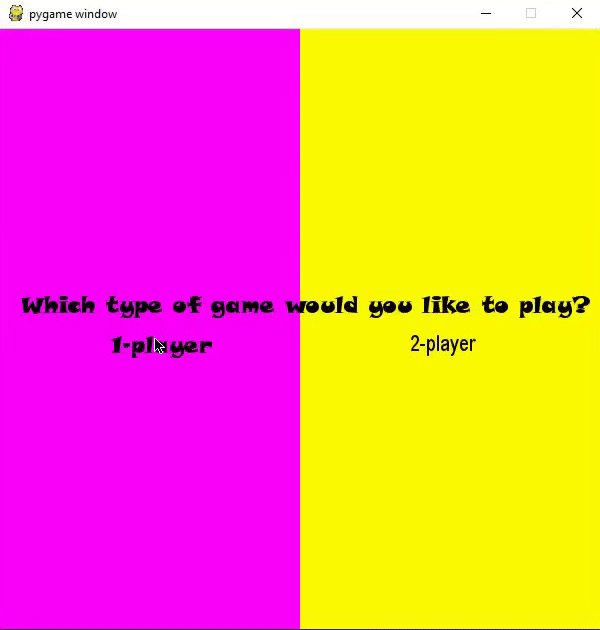

########################## Tic-Tac-Toe ############################

Game of Tic-Tac-Toe made with a GUI in pygame. The game consists
of two parts:

    1 Player: Where you can play against an unbeatable bot that 
              uses the minimax algorithm to calculate it's moves

    2 Player: Where players can take turns to play against each 
              other
                            
###############################################################

Requirements:

    Packages - Pygame library
    
###############################################################

Live demo of code:

